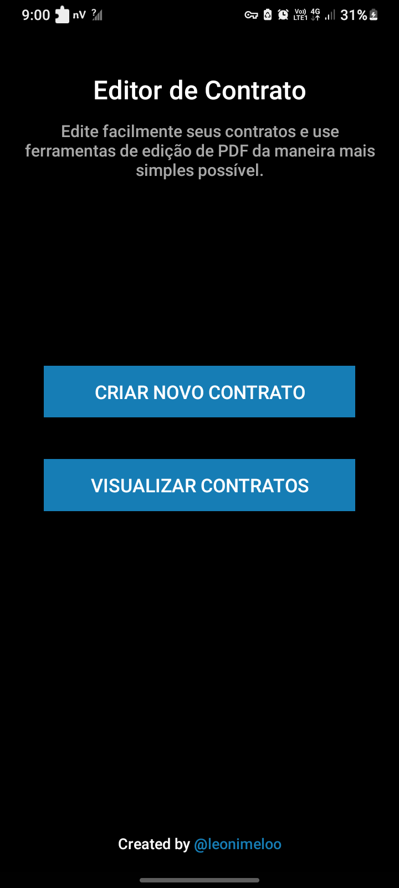
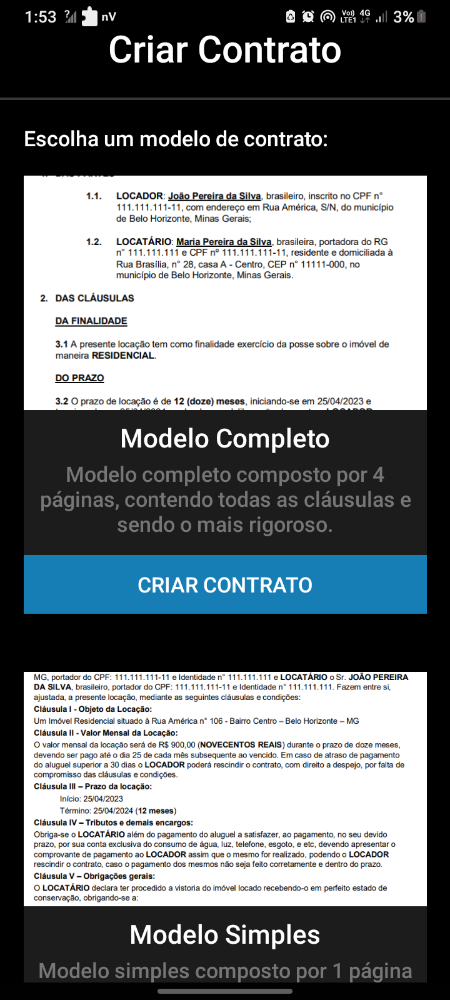
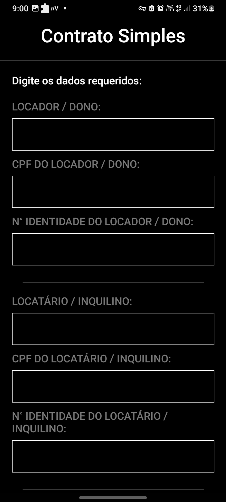
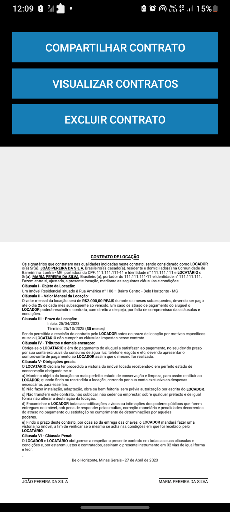

# Editor de Contrato - React Native App

Aplicativo simples para criar contratos de locação a partir de um modelo pronto e exportar em PDF. 

## Uso:

1. Preencha os dados do contrato.
2. O aplicativo cria um contrato em pdf com os dados informados.
3. Pronto para usar, apenas compartilhe.

## Instalação:

* Instale as dependências necessárias:

```
npm install
```
* Execute o aplicativo:

```
npx react-native run-android
```
* Crie sua própria release:

[Veja este guia para criar sua própria versão](https://medium.com/geekculture/react-native-generate-apk-debug-and-release-apk-4e9981a2ea51)

## Exemplo:

<div style="display: flex; flex-direction: row;flex-wrap: wrap;justify-content: center; margin-top: 12px">
    
    
    
    
</div>

## Informações:

Este é o meu primeiro aplicativo React Native sem expo, criado para resolver um problema real, principalmente na minha família que sempre me pediam para criar contratos para eles.

 Feito para facilitar a criação de contratos em PDF, de forma rápida e fácil, para pessoas que não tem experiência em programas de edição/criação de PDF. 